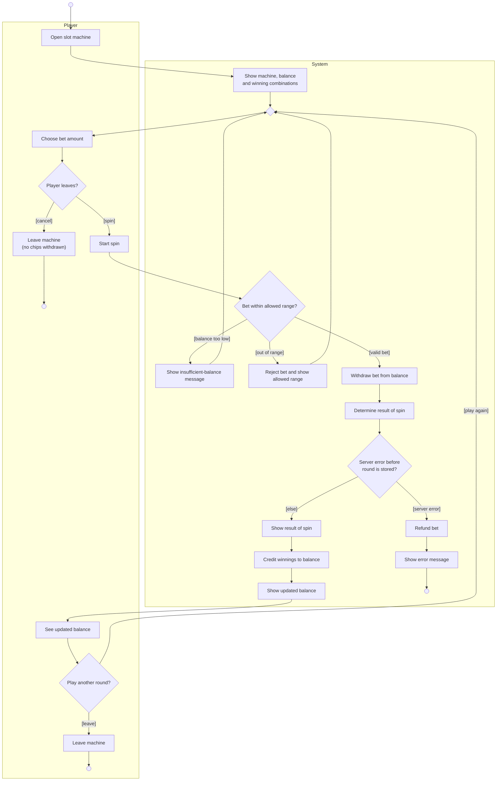

```mermaid
flowchart TB
    S((" ")):::init

    subgraph System
        direction TB
        B["Show machine, balance<br/>and winning combinations"]
        M{" "}
        D3{"Bet within allowed range?"}
        R1["Show insufficient-balance message"]
        R2["Reject bet and show allowed range"]
        W["Withdraw bet from balance"]
        F["Determine result of spin"]
        G{"Server error before<br/>round is stored?"}
        H["Refund bet"]
        I["Show error message"]
        J["Credit winnings to balance"]
        N["Show result of spin"]
        O["Show updated balance"]
        END2((" ")):::final
    end

    subgraph Player
        direction TB
        A["Open slot machine"]
        C["Choose bet amount"]
        D{"Player leaves?"}
        L1["Leave machine<br/>(no chips withdrawn)"]
        E["Start spin"]
        P["See updated balance"]
        Q{"Play another round?"}
        L2["Leave machine"]
	    END1((" ")):::final
	    END3((" ")):::final    
    end

    S --> A --> B --> M
    M --> C --> D
    D -- "[cancel]" --> L1 --> END1
    D -- "[spin]" --> E --> D3
    D3 -- "[balance too low]" --> R1 --> M
    
    D3 -- "[out of range]" --> R2 --> M
    D3 -- "[valid bet]" --> W --> F --> G
    G -- "[server error]" --> H --> I --> END2
    G -- "[else]" --> N --> J --> O --> P --> Q
    Q -- "[play again]" --> M
    Q -- "[leave]" --> L2 --> END3
```
