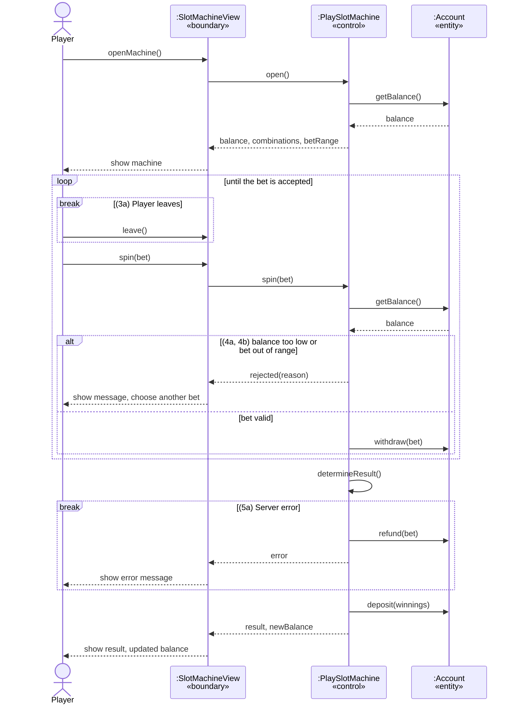

```mermaid
sequenceDiagram
    actor Player
    participant V as :SlotMachineView<br/>«boundary»
    participant C as :PlaySlotMachine<br/>«control»
    participant A as :Account<br/>«entity»

    Player->>V: openMachine()
    V->>C: open()
    C->>A: getBalance()
    A-->>C: balance
    C-->>V: balance, combinations, betRange
    V-->>Player: show machine

    loop until the bet is accepted
        break (3a) Player leaves
            Player->>V: leave()
        end
        Player->>V: spin(bet)
        V->>C: spin(bet)
        C->>A: getBalance()
        A-->>C: balance
        alt (4a, 4b) balance too low or bet out of range
            C-->>V: rejected(reason)
            V-->>Player: show message, choose another bet
        else bet valid
            C->>A: withdraw(bet)
        end
    end

    C->>C: determineResult()
    break (5a) Server error
        C->>A: refund(bet)
        C-->>V: error
        V-->>Player: show error message
    end
    C->>A: deposit(winnings)
    C-->>V: result, newBalance
    V-->>Player: show result, updated balance
```
