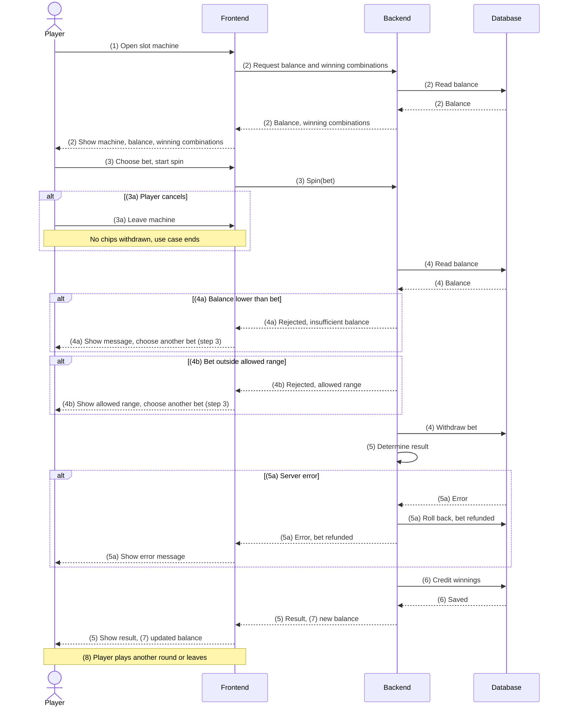

```mermaid
sequenceDiagram
    actor Player
    participant Frontend
    participant Backend
    participant Database

    Player->>Frontend: (1) Open slot machine
    Frontend->>Backend: (2) Request balance and winning combinations
    Backend->>Database: (2) Read balance
    Database-->>Backend: (2) Balance
    Backend-->>Frontend: (2) Balance, winning combinations
    Frontend-->>Player: (2) Show machine, balance, winning combinations

	Player->>Frontend: (3) Choose bet, start spin
	Frontend->>Backend: (3) Spin(bet)
	alt (3a) Player cancels
        Player->>Frontend: (3a) Leave machine
        Note over Player,Frontend: No chips withdrawn, use case ends
    end
	Backend->>Database: (4) Read balance
	Database-->>Backend: (4) Balance
	alt (4a) Balance lower than bet
            Backend-->>Frontend: (4a) Rejected, insufficient balance
            Frontend-->>Player: (4a) Show message, choose another bet (step 3)
        end
	alt (4b) Bet outside allowed range
		Backend-->>Frontend: (4b) Rejected, allowed range
		Frontend-->>Player: (4b) Show allowed range, choose another bet (step 3)
	end
	Backend->>Database: (4) Withdraw bet
	Backend->>Backend: (5) Determine result
	alt (5a) Server error
		Database-->>Backend: (5a) Error
		Backend->>Database: (5a) Roll back, bet refunded
		Backend-->>Frontend: (5a) Error, bet refunded
		Frontend-->>Player: (5a) Show error message
	end
	Backend->>Database: (6) Credit winnings
	Database-->>Backend: (6) Saved
	Backend-->>Frontend: (5) Result, (7) new balance
	Frontend-->>Player: (5) Show result, (7) updated balance
	Note over Player,Frontend: (8) Player plays another round or leaves

```
