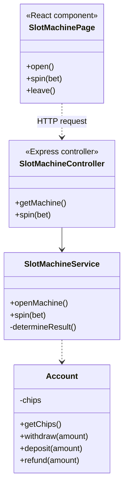

```mermaid
classDiagram
    direction TB
 
    class SlotMachinePage {
        <<React component>>
        +open()
        +spin(bet)
        +leave()
    }
    class SlotMachineController {
        <<Express controller>>
        +getMachine()
        +spin(bet)
    }
    class SlotMachineService {
        +openMachine()
        +spin(bet)
        -determineResult()
    }
    class Account {
        -chips
        +getChips()
        +withdraw(amount)
        +deposit(amount)
        +refund(amount)
    }
 
    SlotMachinePage ..> SlotMachineController : HTTP request
    SlotMachineController --> SlotMachineService
    SlotMachineService ..> Account
```
