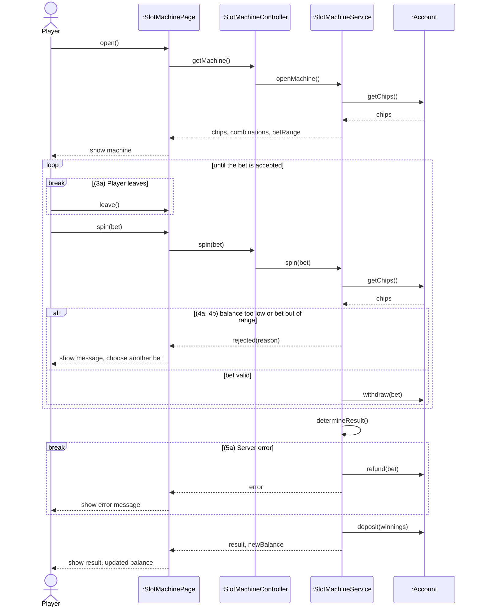

```mermaid
sequenceDiagram
    actor Player
    participant P as :SlotMachinePage
    participant C as :SlotMachineController
    participant S as :SlotMachineService
    participant A as :Account
 
    Player->>P: open()
    P->>C: getMachine()
    C->>S: openMachine()
    S->>A: getChips()
    A-->>S: chips
    S-->>P: chips, combinations, betRange
    P-->>Player: show machine
 
    loop until the bet is accepted
        break (3a) Player leaves
            Player->>P: leave()
        end
        Player->>P: spin(bet)
        P->>C: spin(bet)
        C->>S: spin(bet)
        S->>A: getChips()
        A-->>S: chips
        alt (4a, 4b) balance too low or bet out of range
            S-->>P: rejected(reason)
            P-->>Player: show message, choose another bet
        else bet valid
            S->>A: withdraw(bet)
        end
    end
 
    S->>S: determineResult()
    break (5a) Server error
        S->>A: refund(bet)
        S-->>P: error
        P-->>Player: show error message
    end
    S->>A: deposit(winnings)
    S-->>P: result, newBalance
    P-->>Player: show result, updated balance
```
