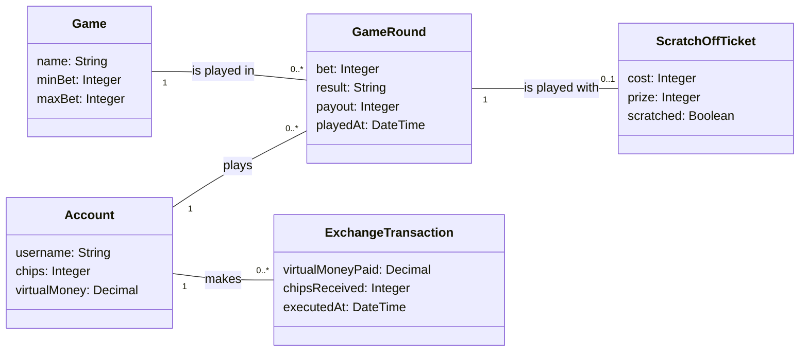

```mermaid
classDiagram
    direction LR
 
    class Account {
        username: String
        chips: Integer
        virtualMoney: Decimal
    }
    class Game {
        name: String
        minBet: Integer
        maxBet: Integer
    }
    class GameRound {
        bet: Integer
        result: String
        payout: Integer
        playedAt: DateTime
    }
    class ScratchOffTicket {
        cost: Integer
        prize: Integer
        scratched: Boolean
    }
    class ExchangeTransaction {
        virtualMoneyPaid: Decimal
        chipsReceived: Integer
        executedAt: DateTime
    }
 
    Account "1" -- "0..*" GameRound : plays
    Game "1" -- "0..*" GameRound : is played in
    GameRound "1" -- "0..1" ScratchOffTicket : is played with
    Account "1" -- "0..*" ExchangeTransaction : makes
```
