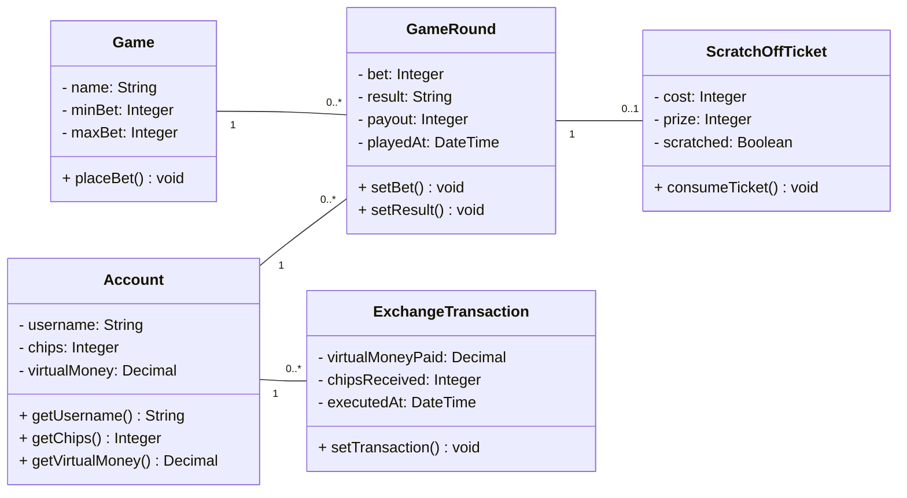

```mermaid
classDiagram
    direction LR
 
    class Account {
        - username: String
        - chips: Integer
        - virtualMoney: Decimal
        + getUsername() String
        + getChips() Integer
        + getVirtualMoney() Decimal
    }
    class Game {
        - name: String
        - minBet: Integer
        - maxBet: Integer
        + placeBet() void
    }
    class GameRound {
        - bet: Integer
        - result: String
        - payout: Integer
        - playedAt: DateTime
        + setBet() void
        + setResult() void
    }
    class ScratchOffTicket {
        - cost: Integer
        - prize: Integer
        - scratched: Boolean
        + consumeTicket() void
    }
    class ExchangeTransaction {
        - virtualMoneyPaid: Decimal
        - chipsReceived: Integer
        - executedAt: DateTime
        + setTransaction() void
    }
 
    Account "1" -- "0..*" GameRound
    Game "1" -- "0..*" GameRound
    GameRound "1" -- "0..1" ScratchOffTicket
    Account "1" -- "0..*" ExchangeTransaction
```
